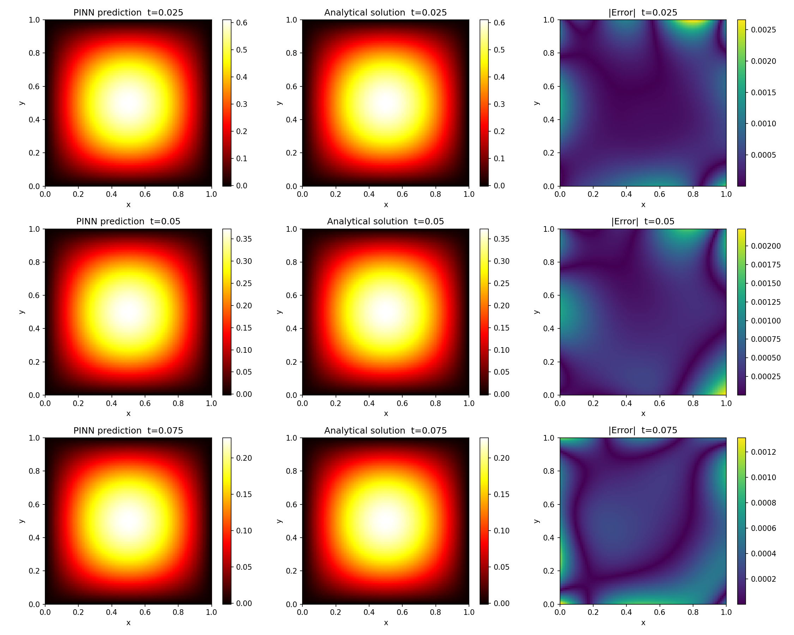
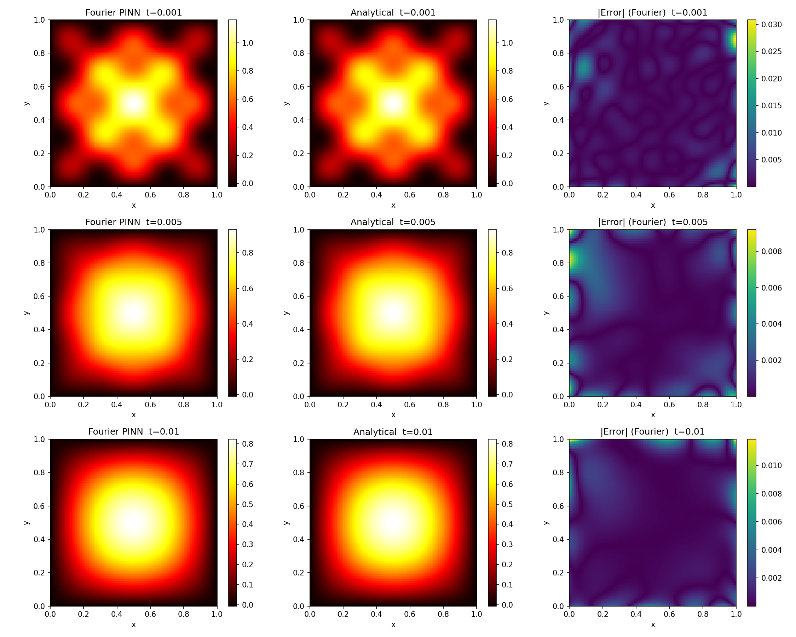
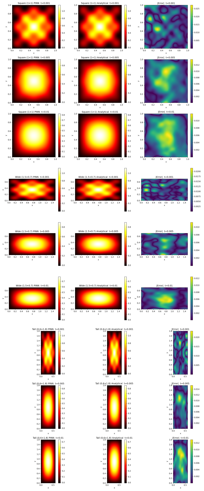
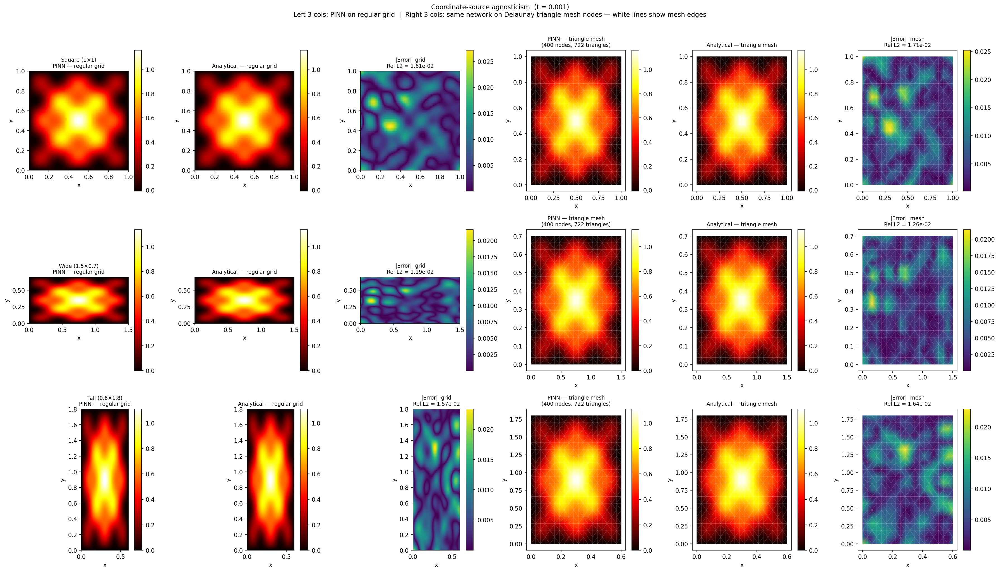

# PINNs for the 2D Heat Equation

A three-phase progression of Physics-Informed Neural Networks (PINNs) solving the transient 2D heat equation — from a plain baseline network, through multi-scale Fourier feature embeddings, to a single parametric network that generalizes across an entire family of plate geometries without retraining.

---

## Problem Statement

Heat conduction in a solid plate is governed by the parabolic partial differential equation:

```
∂T/∂t = α (∂²T/∂x² + ∂²T/∂y²)
```

where T(x, y, t) is the temperature field and α is the thermal diffusivity. Given a rectangular plate with zero-temperature boundaries (Dirichlet conditions T=0 on all edges) and a known sinusoidal initial temperature distribution, the problem is to recover the full space-time solution T(x, y, t) without numerical simulation data — using only the governing equation, boundary conditions, and initial condition as training signal.

The problem has a known closed-form analytical solution, which makes it possible to measure accuracy exactly. However, the PDE has multiple coexisting spatial frequency components: a smooth fundamental mode and a high-frequency harmonic that decays five orders of magnitude faster. Standard neural networks cannot capture both scales well simultaneously, and training becomes harder still when the plate geometry itself is unknown at training time.

---

## Goals

- Solve the 2D transient heat equation ∂T/∂t = α(∂²T/∂x² + ∂²T/∂y²) on a rectangular domain using neural networks trained entirely from physics — no simulation or measurement data.
- Enforce Dirichlet boundary conditions (T=0 on all edges) and a sinusoidal initial condition as soft constraints through the loss function.
- Demonstrate that a plain feedforward network (baseline) achieves reasonable accuracy on a single-mode IC.
- Demonstrate that multi-scale Fourier feature embeddings significantly outperform the plain baseline on a harder, two-mode IC with a high-frequency component.
- Train a single parametric network that generalizes across all rectangular plate geometries with Lx, Ly ∈ [0.5, 2.0] without retraining.
- Evaluate accuracy quantitatively against the analytical solution using relative L2 error on a dense evaluation grid.
- Demonstrate that the parametric model produces consistent accuracy regardless of whether evaluation points come from a regular grid or an unstructured triangle mesh.

**Assumptions:**
- Thermal diffusivity α = 1.0 (non-dimensional).
- Dirichlet boundary conditions only (T=0 on all edges).
- Initial condition is a known sinusoidal function; no measured initial data is used.
- Accuracy is measured relative to the closed-form analytical solution.

---

## Non-Goals

- **3D geometry.** The problem is restricted to 2D rectangular domains. Volumetric heat conduction in 3D solids is out of scope.
- **Non-Dirichlet boundary conditions.** Neumann (flux), Robin (convective), or mixed boundary conditions are not considered.
- **Variable thermal diffusivity.** α is fixed at 1.0. Parameterizing α as an additional input is not addressed.
- **Non-rectangular geometry.** Circular, triangular, or arbitrarily-shaped domains are not covered.
- **Real experimental data.** No measured temperature data is used at any stage. All training signal comes from the PDE and its boundary/initial conditions.
- **Inverse problems.** Estimating PDE parameters or boundary conditions from measurements is out of scope.
- **GPU-optimized training.** All runs execute on CPU; large-scale parallel training is not addressed.
- **Production deployment.** The notebooks are research and demonstration artifacts, not production inference systems.

---

## Solution

The project is structured as three progressively harder phases, each building on the previous one.

**Phase 1** establishes a plain feedforward neural network as a baseline PINN. The network takes (x, y, t) as input and outputs temperature. It is trained by minimizing a composite loss of three residuals: the PDE residual at interior collocation points, the boundary condition residual on the four edges, and the initial condition residual at t=0. No simulation data is used — the physics is encoded entirely through the loss terms and automatic differentiation.

**Phase 2** addresses the spectral bias of plain MLPs. Neural networks naturally learn low-frequency functions first and struggle to represent rapidly oscillating components. The solution is to transform the raw inputs through a frozen multi-scale random Fourier feature embedding before the MLP, which provides explicit high-frequency basis functions and removes the network's need to discover them through gradient descent.

**Phase 3** eliminates the need to retrain for each new geometry. The domain dimensions Lx and Ly are added as additional inputs to the network, which is trained by sampling a fresh random geometry at every optimization step. A single trained network then evaluates any plate within the parameter range without modification.

---

## Implementation

### `pinn_2d.ipynb` (Baseline PINN)

**PDE and domain.** The heat equation on the unit square [0,1]² over t ∈ [0, 0.1]. Single-mode IC: T(x,y,0) = sin(πx)sin(πy). Analytical solution: T(x,y,t) = sin(πx)sin(πy)·exp(−2π²t).

**Libraries.** DeepXDE (framework), PyTorch (backend), NumPy, Matplotlib.

**Architecture.** Fully-connected network with input dimension 3, five hidden layers of 32 neurons each, and a scalar temperature output. Tanh activations, Glorot normal initialization. Total parameters: 4,385.

**Data sampling.** DeepXDE generates three sets of collocation points using Latin Hypercube Sampling (LHS): 10,000 interior points across the space-time domain, 800 boundary points on the four edges, and 500 points at t=0 for the IC. No simulation data is used.

**Training.** Two-stage: 10,000 Adam steps at lr=1×10⁻³ with loss weights W_PDE=1, W_BC=10, W_IC=10, followed by L-BFGS fine-tuning. PDE residuals are computed via DeepXDE's automatic differentiation wrappers. L-BFGS applies second-order curvature information to polish the solution after Adam finds the broad basin.

**Evaluation.** Relative L2 error against the analytical solution on a 100×100 grid at t=0.03, 0.05, 0.07.

---

### `pinn_2d_fourier.ipynb` (Fourier Feature PINN)

**PDE and domain.** Same heat equation on [0,1]² but with a harder two-mode IC: T(x,y,0) = sin(πx)sin(πy) + 0.3·sin(5πx)sin(5πy). Time window shortened to t ∈ [0, 0.01] because the high-frequency mode (λ₂=50π²≈493) decays to 0.2% of its initial amplitude by t=0.01. Analytical solution has both modes decaying at their respective rates.

**Libraries.** DeepXDE, PyTorch, NumPy, Matplotlib. PyTorch `nn.Module` is used directly to build the custom network class, registered into DeepXDE via its `NN` base class.

**Architecture.** `MultiscaleFourierNet`: inputs (x, y, t) are normalized to [−1,1], then passed through a frozen multi-scale Fourier embedding with σ=[1,3,5] and M=32 random frequencies per band, giving 3×2×32=192 features. These feed into a 3-layer MLP with 64 neurons per layer and tanh activations. The random frequency matrices are registered as non-trainable parameters. Total parameters: 21,025 (20,737 trainable, 288 frozen). A plain FNN baseline (Phase 1 architecture applied to the same two-mode problem) is trained in parallel in the same notebook for direct comparison.

**Data sampling.** Same structure as Phase 1: 10,000 LHS interior points, 800 boundary points, 500 IC points on the shorter time window [0, 0.01].

**Training.** Identical two-stage procedure: Adam (10,000 steps, lr=1×10⁻³, W_PDE=1, W_BC=10, W_IC=10) followed by L-BFGS, both via DeepXDE's interface.

**Evaluation.** Both Fourier and baseline models evaluated at t=0.001, 0.005, 0.010 on a 100×100 grid. Side-by-side comparison with improvement factor reported.

---

### `pinn_2d_parametric.ipynb` (Parametric Domain PINN)

**PDE and domain.** Same heat equation but on a variable domain [0,Lx]×[0,Ly] with Lx, Ly ∈ [0.5, 2.0]. IC adapted to plate dimensions: T(x,y,0) = sin(πx/Lx)sin(πy/Ly) + 0.3·sin(5πx/Lx)sin(5πy/Ly). Decay rates depend on geometry: λ₁=π²α(1/Lx²+1/Ly²), λ₂=25λ₁. A larger plate decays more slowly.

**Libraries.** PyTorch, NumPy, Matplotlib, SciPy. DeepXDE is not used — its geometry objects have fixed bounds and cannot accommodate continuous geometry resampling at each training step.

**Architecture.** `ParametricFourierNet` takes a 5-dimensional input (x, y, t, Lx, Ly). Inside `forward()`, physical coordinates are normalized: ξ=2x/Lx−1, η=2y/Ly−1, t_norm=2t/T_MAX−1, Lx_norm=(Lx−1.25)/0.75, Ly_norm=(Ly−1.25)/0.75. The spatial-temporal triple (ξ,η,t_norm) passes through the same multi-scale Fourier embedding (σ=[1,3,5], M=32, 192 features). The geometry parameters (Lx_norm, Ly_norm) are appended directly — they are not Fourier-encoded, since domain size is a scalar quantity not an oscillatory one. The resulting 194-dimensional vector feeds into 6 hidden layers of 256 neurons each with tanh activations and a linear output. Total trainable parameters: 379,137. PyTorch autograd differentiates through the normalization in `forward()` automatically, so PDE residuals are computed in correct physical coordinates without Jacobian corrections.

**Data sampling.** At every Adam step, (Lx, Ly) is sampled fresh from Uniform[0.5,2.0]². For that geometry: 3,000 random interior points (x∈[0,Lx], y∈[0,Ly], t∈[0,T_MAX]), 800 boundary points on the four edges, and 2,000 IC points at t=0. Points are generated with `requires_grad=True` so that `torch.autograd.grad` can compute the PDE residual as second-order derivatives.

**Training.** A custom PyTorch loop replaces DeepXDE. Adam runs for 40,000 steps with cosine annealing (lr: 1×10⁻³ → 1×10⁻⁵) and gradient clipping at max norm 1.0 to suppress PDE loss spikes. Dynamic loss weighting runs every 1,000 steps: the gradient norm of each loss term with respect to all parameters is measured, and weights are adjusted via exponential moving average (EMA=0.9) so that each term exerts equal gradient influence on the network. Weights evolved automatically from W_PDE=1, W_BC=10, W_IC=30 to W_PDE≈0.34, W_BC≈2417, W_IC≈1019 — the large BC and IC boosts were discovered automatically and were essential for convergence. L-BFGS follows Adam on a fixed 3×3 grid of nine geometries (Lx,Ly ∈ {0.5,1.25,2.0}²). Collocation points for all nine geometries are pre-sampled once before the optimizer step; the closure reuses these fixed tensors on every evaluation, satisfying L-BFGS's determinism requirement.

**Evaluation.** Three held-out geometries not in the L-BFGS grid — Square (1×1), Wide (1.5×0.7), Tall (0.6×1.8) — evaluated at t=0.001, 0.005, 0.010 on a 100×100 grid. Additionally, a coordinate-source agnosticism test queries the same trained network at nodes of a Delaunay triangulation (400 nodes, ~722 triangles, built with `scipy.spatial.Delaunay`) and compares accuracy to the regular grid. A regression check confirms the unit-square case stays within 5% L2 relative to Phase 2's reference result.

---

## Conclusion

### Baseline PINN

The plain 4,385-parameter network accurately solves the single-mode heat equation. At t=0.03, 0.05, 0.07 the relative L2 errors are 0.17%, 0.25%, and 0.27% respectively — sub-percent accuracy with no simulation data, purely from physics-based training.

| t | Rel. L2 Error |
|---|---|
| 0.03 | 0.17% |
| 0.05 | 0.25% |
| 0.07 | 0.27% |



---

### Fourier Feature PINN

Adding the high-frequency IC mode sin(5πx)sin(5πy) exposes the spectral bias of the plain MLP — it scores 18.6% L2 error at t=0.001 where the high-frequency component is strongest. The Fourier feature network reduces this to 0.60%, a 31× improvement. Gains are largest at early times when both modes are present and diminish at later times once the high-frequency mode has decayed.

| t | Fourier L2 | Baseline L2 | Improvement |
|---|---|---|---|
| 0.001 | 0.60% | 18.6% | 31× |
| 0.005 | 0.31% | 3.91% | 12.7× |
| 0.010 | 0.31% | 1.89% | 6.0× |



---

### Parametric Domain PINN

A single 379,137-parameter network generalizes across all rectangular geometries with Lx,Ly ∈ [0.5, 2.0]. All nine test cases (3 geometries × 3 times) stay under 2% L2 error, with no retraining. The regression check confirms the unit-square case at 1.61% — a 2.7× accuracy cost relative to Phase 2's dedicated single-geometry training, which is the expected price of generalization across a 2D parameter space. The mesh comparison confirms the network's accuracy is coordinate-source agnostic: errors on Delaunay triangle mesh nodes differ from the regular grid by at most 0.1%.

| Geometry | t=0.001 | t=0.005 | t=0.010 |
|---|---|---|---|
| Square (1×1) | 1.61% | 1.36% | 1.53% |
| Wide (1.5×0.7) | 1.19% | 0.86% | 1.32% |
| Tall (0.6×1.8) | 1.57% | 1.23% | 1.76% |




---

## Out-of-Distribution (OOD) Study

The trained parametric model was evaluated on three OOD cases to document its limits and test targeted fixes. Notebooks are in `notebooks/ood/`.

### Failure Analysis (`pinn_2d_ood_failure.ipynb`)

Three cases were tested. For each, both relative L2 error and PDE residual `|∂T/∂t − α∇²T|` were computed at OOD points to distinguish mathematical failure (MLP extrapolation) from physical violation (PDE not satisfied).

**Case 1 — Geometry extrapolation (`Lx, Ly` outside `[0.5, 2.0]`)**
The geometry normalization `lx_n = (Lx − 1.25) / 0.75` maps the training range to `[−1, 1]`. Outside this range, tanh activations saturate and the geometry conditioning collapses. Above the boundary (e.g. Lx=2.5), PDE residual stays low but L2 error rises — a mathematical MLP failure. Below the boundary (e.g. Lx=0.2), the PDE residual spikes to 61.9 — both math and physics break down due to deeper tanh saturation.

| Geometry | L2 Error |
|---|---|
| In-dist 1.0×1.0 | 1.6% |
| Near-OOD 0.3×1.0 | 4.3% |
| Far-OOD 0.15×0.15 | 93% |

**Case 2 — Temporal extrapolation (`t > T_MAX = 0.01`)**
The sharpest failure. PDE residual jumps from 0.97 at T_MAX to 71.5 at the first OOD time step (t=0.015). The model plateaus rather than continuing to decay, causing `∂T/∂t ≈ 0` while `α∇²T ≠ 0` — a direct physics violation alongside the mathematical extrapolation failure.

| t | L2 Error |
|---|---|
| T\_MAX (in-dist) | 1.4% |
| 2×T\_MAX | 227% |
| 5×T\_MAX | 543% |

**Case 3 — Thermal diffusivity mismatch (`α ≠ 1.0`)**
A silent failure. `α` is hardcoded into the PDE loss and is not a model input. The model's own PDE residual stays flat at ~1.7 regardless of the true α — it always satisfies `∂T/∂t = 1.0×∇²T` perfectly. But the residual against the true PDE rises to 118 at α=4. The output looks physically plausible with no detectable failure signal.

| α | L2 Error |
|---|---|
| 0.25 | 7.8% |
| 1.00 (in-dist) | 1.6% |
| 4.00 | 16.8% |

---

### Fixes (`pinn_2d_ood_fixes.ipynb`)

**Fix 1 — Specialized Transfer Learning (geometry)**
One dedicated model per target geometry, initialized from the pretrained checkpoint and fine-tuned with `lr=1e-4` and cosine annealing for 10k steps on that geometry only. The original model is untouched. Works well for geometries just outside the boundary; improvement is larger above the bound than below due to asymmetric tanh gradient flow.

| Geometry | Before | After | Improvement |
|---|---|---|---|
| Lx=0.2 (below bound) | 14.0% | 7.4% | 1.9× |
| Lx=2.5 (above bound) | 2.77% | 0.57% | 4.9× |

**Fix 2 — Moving Time Window (temporal)**
A second model is trained on `t ∈ [T_MAX, 2×T_MAX]`. Time is shifted as `t' = t − T_MAX` so the normalization stays in `[−1, 1]`. The IC at `t'=0` is window 1's output at T_MAX. Windows can be chained to extend the time horizon further.

| t | Before (W1 extrapolating) | After (W2) |
|---|---|---|
| 1.5×T\_MAX | 37% | 4.4% |
| 2×T\_MAX | 227% | 7.1% |

**Fix for Case 3 (diffusivity)** — not implemented. Requires adding `α` as a sixth network input and retraining, which is structurally identical to how `Lx` and `Ly` were added in Phase 3.

---

## Improvements

### 3D Extension

The current formulation is limited to 2D plates. Extending to a 3D volume would require adding a z-coordinate and Lz as a fifth geometry parameter, and scaling up the network and collocation point budget accordingly. The architecture already separates spatial/temporal Fourier encoding from geometry parameters, so the extension is structurally straightforward.

### Parameterizing Thermal Diffusivity

α is fixed at 1.0. Making it an additional input (alongside Lx, Ly) would let the model generalize across materials, turning it into a true material-parametric surrogate.

### Adaptive Collocation Sampling

Interior points are drawn uniformly at random at every step. Methods like residual-based adaptive refinement (RAR) concentrate points where the PDE residual is largest, improving accuracy in regions with steep gradients for the same computational budget.

### NVIDIA Modulus

For production-scale parametric PINNs with GPU acceleration, NVIDIA Modulus provides optimized implementations of Fourier feature networks, adaptive sampling, and distributed training that go well beyond what a custom PyTorch loop can achieve on CPU.

---

## Appendix (other options explored)

### DeepXDE for Parametric Domain

DeepXDE works well when the domain is fixed, but parametric domain needs a new plate size at every training step. DeepXDE does not support that, so a plain PyTorch training loop was written instead.

### Random sampling inside L-BFGS

L-BFGS checks the loss several times before taking each step to make sure it is actually improving. If the training points change between those checks, the loss values are not comparable and the optimizer gets confused and stops making progress. Fixing the points once before the optimizer runs avoids this.

## LLMs Used
1. Gemini (NotebookLM)
2. Claude code
